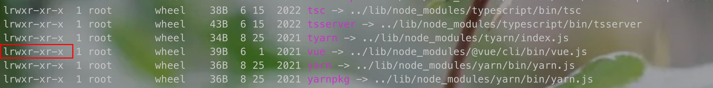
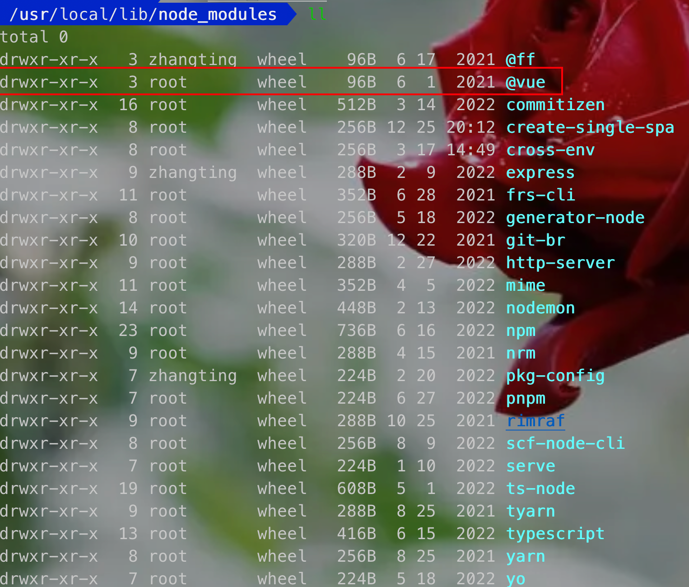

# 脚手架

```bash
vue create vue-app --force
```
- 主命令：vue
- command：create
- param：vue-app
- option：--force

## 脚手架原理

```bash
vue create vue-app --force
# 终端解析vue，找到vue存在的位置，并把后面的create vue-app --force作为参数传入到vue中
which vue

```
1. 终端输入脚手架命令后，会在环境变量找到vue指令`which vue`,找到vue指令存在的位置，其中主要看`bin`和`lib`
2. `/usr/local/bin`下有`vue`命令
3. 利用node执行了`vue.js`文件

> 第一个字母是l表示是软链接，实际指向的是lib中的vue





## 为什么全局安装`@vue/cli`后会添加的命令为vue？

`package.json`中的bin属性，设置的值为vue
## 全局安装`@vue/cli`时发生了什么？

如果安装包的package.json中存在bin，就会解析这个值，并将这个指令添加到全局bin中，并创建软链接
## 为什么vue指向一个js文件，我们却可以直接通过vue命令直接去执行它？

终端中使用vue，调用了which vue找到vue的位置，并执行。
1. #!/usr/bin/env node 到环境变量中找node环境变量，表示使用node来执行。终端中输入`/usr/bin/env node`，其实和执行`node`是一样的效果

## 怎么自己创建指令，执行自己本地的文件

```bash
# 找到环境变量
echo $PATH
```
在任意一个环境变量的bin目录下加自定义指令，并指向本地的文件`pwd`查看本地文件的位置

创建软链接命令
```bash
ln -s [local-url] [alias]
# ln -s test.js my-test
```

给命令实现别名，可以用软链接的方式
